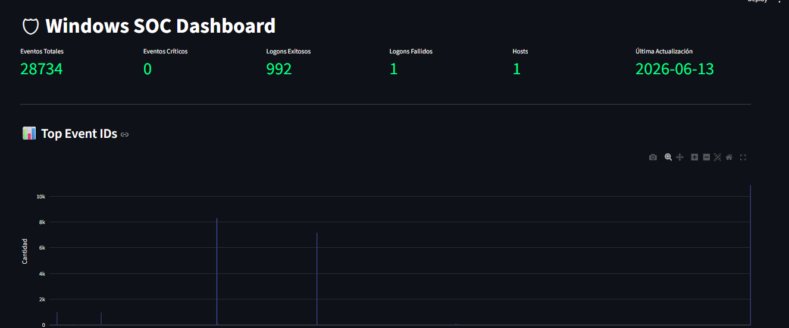
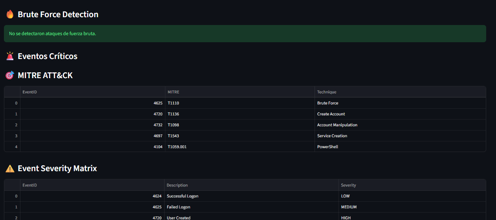
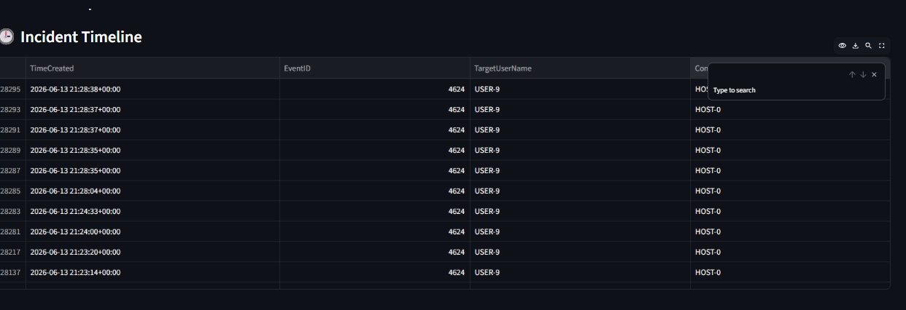
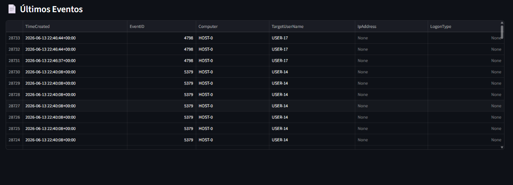

SOC Monitor

Windows Security Operations Center (SOC) Dashboard developed with Python and Streamlit for Windows Event Log analysis, incident monitoring, MITRE ATT&CK mapping, and critical event detection.


## Dashboard Overview

## MITRE ATT&CK Mapping

## Incident Timeline

## Critical Events


## Features

- Windows Event Log Analysis
- EVTX Parsing
- Authentication Monitoring
- Critical Event Detection
- MITRE ATT&CK Mapping
- Incident Timeline
- Security Event Visualization

## Technologies Used

- Python
- Streamlit
- Pandas
- Plotly
- python-evtx

## Usage

```bash
python parser.py
python -m streamlit run app.py
```
